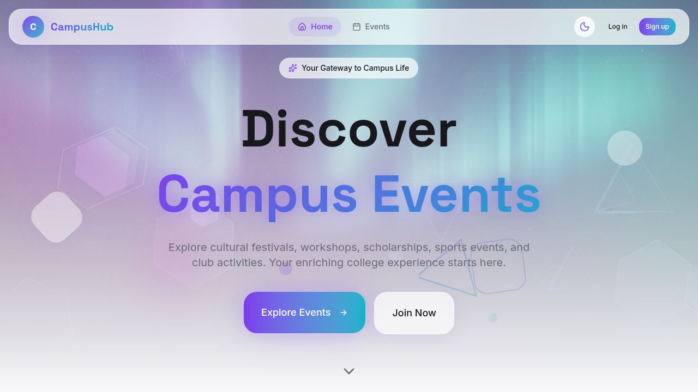

# 🎓 SEU CampusHub



> **A modern, dynamic event management platform tailored for Southeast University students and administrators.**  
> *Discover, Register, and Manage Campus Events with Ease.* 🚀


---

## ✨ Features

### 👨‍🎓 For Students
- **Event Discovery**: Browse upcoming, past, and featured events in a beautiful grid layout.
- **Easy Registration**: One-click registration for events you're interested in.
- **Personal Dashboard**: Track your registrations, interested events, and history.
- **Interactive UI**: Smooth animations, cursor effects, and a responsive design that looks great on any device.
- **Profile Management**: Update your personal details and preferences.

### 🛡️ For Administrators
- **Dashboard Overview**: Get insights into platform usage and event statistics.
- **Event Management**: Create, edit, and delete events with rich text descriptions and banners.
- **Category Control**: Organize events into dynamically managed categories.
- **User Management**: Oversee platform users and manage permissions.
- **Registration Tracking**: View and manage attendee lists for specific events.

---

## 🛠️ Tech Stack

- **Frontend**: [React](https://reactjs.org/) with [Vite](https://vitejs.dev/)
- **Language**: [TypeScript](https://www.typescriptlang.org/)
- **Styling**: [Tailwind CSS](https://tailwindcss.com/) & [Shadcn UI](https://ui.shadcn.com/)
- ** animations**: [Framer Motion](https://www.framer.com/motion/)
- **Routing**: [wouter](https://github.com/molefrog/wouter)
- **State Management**: [TanStack Query](https://tanstack.com/query/latest) & Context API
- **Backend / Auth**: [Firebase](https://firebase.google.com/) (Auth, Firestore, Storage)

---

## 🚀 Getting Started

Follow these steps to set up the project locally.

### Prerequisites
- Node.js (v18 or higher)
- npm or yarn
- A generic Firebase project

### Installation

1. **Clone the repository**
   ```bash
   git clone https://github.com/yourusername/SEU-CampusHub.git
   cd SEU-CampusHub
   ```

2. **Install dependencies**
   ```bash
   npm install
   ```

3. **Configure Environment Variables**
   Create a `.env` file in the root directory and add your Firebase configuration:
   ```env
   VITE_FIREBASE_API_KEY=your_api_key
   VITE_FIREBASE_AUTH_DOMAIN=your_project_id.firebaseapp.com
   VITE_FIREBASE_PROJECT_ID=your_project_id
   VITE_FIREBASE_STORAGE_BUCKET=your_project_id.firebasestorage.app
   VITE_FIREBASE_MESSAGING_SENDER_ID=your_sender_id
   VITE_FIREBASE_APP_ID=your_app_id
   VITE_FIREBASE_MEASUREMENT_ID=your_measurement_id
   ```

4. **Run the development server**
   ```bash
   npm run dev
   ```

   The app should now be running at `http://localhost:5173`.

---

## 📂 Project Structure

```
SEU-CampusHub/
├── client/
│   ├── public/          # Static assets
│   └── src/
│       ├── components/  # Reusable UI components
│       ├── contexts/    # Global state (Auth, Theme, etc.)
│       ├── lib/         # Utilities & Firebase config
│       ├── pages/       # Application views/routes
│       │   ├── admin/   # Admin-specific pages
│       │   └── ...      # Public & User pages
│       └── App.tsx      # Main routing logic
├── .env                 # Environment variables
├── package.json         # Dependencies and scripts
└── vite.config.ts       # Vite configuration
```

---

## 🤝 Contributing

Contributions are welcome! Please feel free to submit a Pull Request.

1. Fork the project
2. Create your feature branch (`git checkout -b feature/AmazingFeature`)
3. Commit your changes (`git commit -m 'Add some AmazingFeature'`)
4. Push to the branch (`git push origin feature/AmazingFeature`)
5. Open a Pull Request

---

## 📄 License

This project is licensed under the MIT License.

---

<p align="center">
  Built with ❤️ by the SEU CampusHub Team
</p>